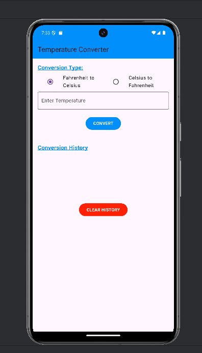
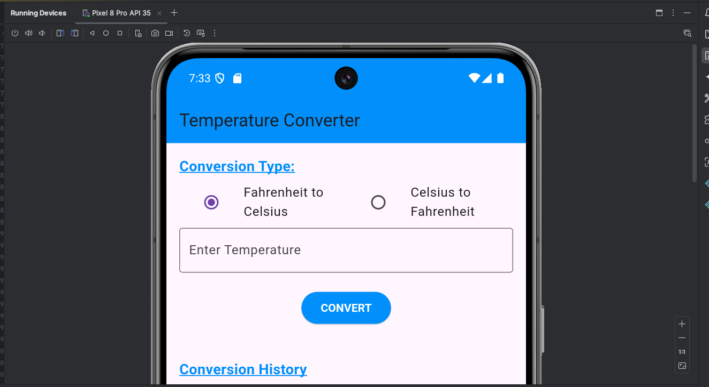

# Temperature Conversion App

This is a temperature conversion app built using Flutter. It allows users to convert temperatures between Fahrenheit and Celsius and stores the conversion history.

## Features
- Convert between Fahrenheit and Celsius.
- Stores conversion history.
- Responsive design for both portrait and landscape orientations.

## Formulae Used
- °F = °C * 9/5 + 32
- °C = (°F - 32) * 5/9

## How to run it
1. Clone the repository from GitHub.
2. Open the project in Android Studio.
3. Run the app on an emulator device.

## Code Explanation
- **Widgets Used:**
    - `TextField`: For user input.
    - `RadioButtons`: To select conversion type.
    - `ElevatedButton`: For the Convert and Clear History buttons.
    - `ListView`: To display the conversion history.

- **State Management:**  
  Used `setState()` in a StatefulWidget to manage the state and reflect the changes in UI based on user interaction.

## Screenshots

## Video Demo
A demo video of the app is available here (https://youtu.be/R-yrTa7i078).
